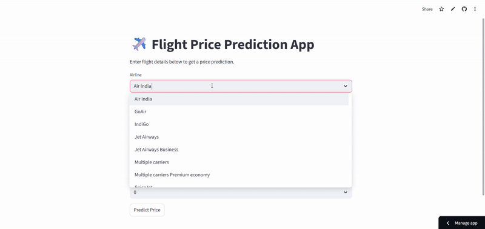
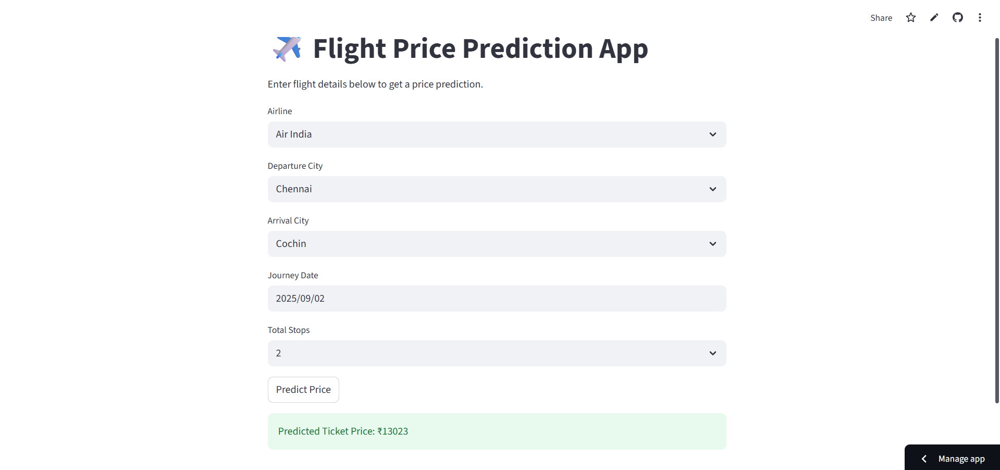

<h1>✈️ Flight Price Prediction App</h1>

An end-to-end Machine Learning project to predict airline ticket prices using <b>Python, SQL, and Streamlit</b>.  

<h2>🔗 Live Demo</h2>

👉 <a href="https://flightpriceprediction-liesha.streamlit.app" target="_blank">Flight Price Prediction App</a>  
 
⚠️ <i>Note: App is hosted on free Streamlit Cloud — it may take up to a minute to load when idle.</i>

<h2>🎥 Demo</h2>

  

<h2>📸 Screenshot</h2>

  

<h2>📂 Project Structure</h2>

<pre>
FLIGHT_PRICE_PREDICTION/
├── data/
│   └── Data_Train.csv
├── model/
│   ├── flight_price_model.pkl
│   ├── model_columns.json
│   └── Flight_price_pred.ipynb
├── sql_queries/
│   └── queries.sql
├── flight_app.py
├── requirements.txt
└── README.md
</pre>

<h2>🎯 Project Goals</h2>
<ul>
  <li>Understand factors affecting airline ticket prices (e.g., stops, airlines, routes).</li>
  <li>Perform <b>SQL-based exploratory analysis</b>.</li>
  <li>Build a regression model to predict flight ticket prices.</li>
  <li>Deploy an interactive <b>Streamlit app</b>.</li>
</ul>

<h2>🔍 SQL-Based Data Exploration</h2>

Some key queries from <code>queries.sql</code>:

<ul>
  <li>Average price per airline</li>
  <li>Number of flights from each source</li>
  <li>Top 5 most expensive flights</li>
  <li>Average price by number of stops</li>
  <li>Cheapest flight per airline</li>
  <li>Most common routes</li>
</ul>

<h2>🤖 Machine Learning Model</h2>
<ul>
  <li><b>Algorithm</b>: Random Forest Regressor</li>
  <li><b>Performance</b>: R² ~83%, MAE ≈ ₹1100</li>
  <li><b>Libraries</b>: pandas, numpy, scikit-learn, matplotlib, seaborn</li>
</ul>

<b>Key Features Engineered:</b>

<ul>
  <li>Duration (hours, minutes)</li>
  <li>Journey Day & Month</li>
  <li>Departure & Arrival times (hour, minute)</li>
  <li>Stops (encoded as numeric)</li>
  <li>Airline, Source, Destination (one-hot encoded)</li>
</ul>

<h2>⚙️ Tech Stack</h2>
<ul>
  <li><b>Python</b> → Data preprocessing, model training</li>
  <li><b>SQL</b> → Data exploration</li>
  <li><b>Scikit-learn</b> → ML modeling</li>
  <li><b>Streamlit</b> → Interactive web app deployment</li>
  <li><b>Joblib</b> → Model serialization</li>
</ul>

<h2>📘 What I Learned</h2>
<ul>
  <li>Real-world data preprocessing (e.g., converting duration strings to numeric).</li>
  <li>Feature engineering for regression tasks.</li>
  <li>SQL queries for structured exploratory analysis.</li>
  <li>Model evaluation using R², MAE, RMSE.</li>
  <li>Deploying ML models with Streamlit.</li>
</ul>
